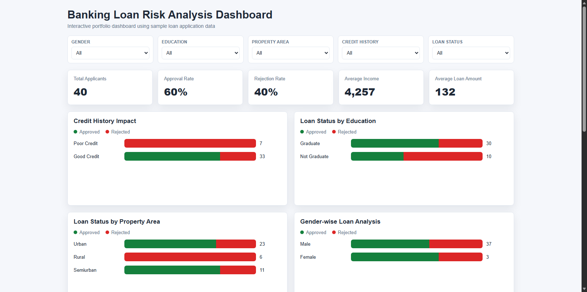
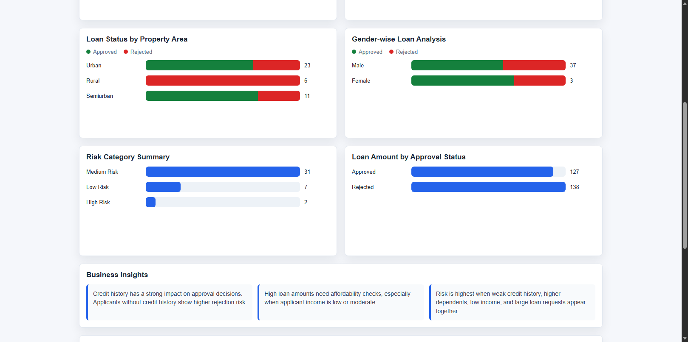
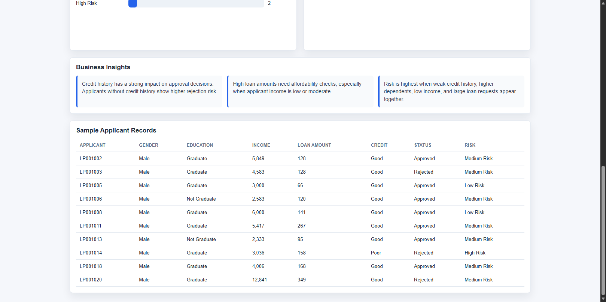

# Banking Loan Risk Analysis

## Project Overview

This project analyzes banking loan application data to identify approval patterns, risky customer segments, and key factors that influence loan decisions. The goal is to support data-driven lending decisions by combining SQL analysis, Python data cleaning, Excel review, and an interactive Power BI dashboard.

The project is designed as a professional Data Analyst portfolio case study, showing the complete workflow from raw data preparation to dashboard creation and business recommendations.

## Business Problem

Banks need to approve loans while minimizing repayment risk. Approving high-risk applicants can increase default losses, while rejecting reliable customers can reduce revenue opportunities. This analysis helps identify which customer attributes are most associated with loan approval, rejection, and potential credit risk.

## Tools Used

| Tool | Purpose |
|---|---|
| Excel | Initial data review and basic validation |
| Python | Data cleaning, preprocessing, and exploratory data analysis |
| Pandas | Handling missing values, duplicates, and data transformations |
| Matplotlib & Seaborn | EDA visualizations |
| SQL | KPI creation, segmentation, and business analysis queries |
| Power BI | Interactive dashboard design and reporting |
| Markdown | Project documentation and business reporting |

## Dataset Information

The dataset represents banking loan applications and may include fields such as:

- Applicant ID
- Gender
- Education
- Dependents
- Applicant income
- Loan amount
- Credit history
- Property area
- Loan status

Data preparation steps include:

- Removed missing values
- Removed duplicate records
- Standardized column names
- Cleaned categorical values
- Converted numeric and date fields where applicable
- Exported a cleaned CSV for analysis and dashboarding

This repository includes sample data, so the project can be opened and reviewed immediately.

## Project Structure

```text
Banking-Loan-Risk-Analysis/
|-- dataset/
|   |-- raw/
|   |-- cleaned/
|   `-- README.md
|-- SQL/
|   |-- loan_risk_analysis_queries.sql
|   `-- README.md
|-- Power-BI-Dashboard/
|   |-- dashboard_design_guide.md
|   |-- loan_risk_dashboard.html
|   `-- README.md
|-- reports/
|   |-- business_insights.md
|   |-- loan_risk_analysis_report.md
|   |-- resume_project_description.md
|   `-- README.md
|-- scripts/
|   |-- clean_loan_dataset.py
|   |-- eda_loan_dataset.py
|   `-- risk_scoring.py
|-- screenshots/
|   `-- README.md
`-- README.md
```

## Key Analysis Areas

- Total loan applicants
- Loan approval rate and rejection rate
- Average applicant income
- Average loan amount
- Credit history impact on loan approval
- Loan status by education
- Loan status by property area
- Gender-wise loan analysis
- Dependents vs approval rate
- High-risk customer categories

## Key Insights

- Credit history is one of the strongest indicators of loan approval and repayment reliability.
- Applicants with positive credit history are more likely to receive loan approval.
- High loan amounts combined with low or moderate income may indicate higher repayment risk.
- Income should be evaluated together with loan amount to understand affordability.
- Education, property area, dependents, and gender help reveal customer segment patterns.
- Risk is highest when multiple weak indicators appear together, such as no credit history, low income, and high loan amount.

## Power BI Dashboard

The dashboard is designed to give stakeholders a quick view of loan portfolio risk and approval trends.

You can also open the working browser dashboard without Power BI:

[Open Browser Dashboard](</Power-BI-Dashboard/loan_risk_dashboard.html>)

Recommended dashboard sections:

- KPI cards for total applicants, approval rate, rejection rate, average income, and average loan amount
- Credit history impact chart
- Loan status by education
- Loan status by property area
- Gender-wise loan analysis
- Interactive slicers for gender, education, property area, credit history, dependents, and loan status

Dashboard design guide:

[Power BI Dashboard Design Guide](</Power-BI-Dashboard/dashboard_design_guide.md>)

## Dashboard Screenshots

Dashboard screenshots are included in the `screenshots` folder.







## SQL Analysis

The SQL analysis includes beginner-friendly queries for:

- Total applicants
- Approved vs rejected loans
- Average applicant income
- Applicants with high loan amounts
- Approval by education
- Credit history impact
- Risky customer categories
- Gender-wise loan analysis
- Property area analysis
- Dependents vs approval rate

SQL file:

[loan_risk_analysis_queries.sql](</SQL/loan_risk_analysis_queries.sql>)

## Python Scripts

Clean the raw dataset:

```powershell
python scripts/clean_loan_dataset.py
```

Run exploratory data analysis:

```powershell
python scripts/eda_loan_dataset.py
```

The EDA script saves visualization images in the `screenshots` folder.

Create beginner-friendly customer risk scores:

```powershell
python scripts/risk_scoring.py
```

## Business Recommendations

- Use a risk-based loan approval process that considers credit history, income, loan amount, dependents, and property area together.
- Apply stricter verification for applicants with missing or poor credit history.
- Evaluate loan affordability using income-to-loan amount or debt-to-income logic before approving larger loans.
- Offer adjusted loan terms, smaller loan amounts, collateral requirements, or co-applicant options for higher-risk applicants.
- Monitor approved high-risk customers after loan disbursement to detect repayment issues early.
- Track approval and rejection trends through a Power BI dashboard for ongoing portfolio review.

## Future Improvements

- Add a larger real-world banking loan dataset.
- Include debt-to-income ratio and employment stability features.
- Build a predictive loan default risk model.
- Add Power BI drill-through pages for customer segment analysis.
- Compare approval patterns across different regions and customer groups.
- Automate the data cleaning workflow.
- Add a final exported PDF version of the dashboard.

## Portfolio Value

This project demonstrates practical Data Analyst skills in data cleaning, SQL querying, exploratory analysis, dashboard planning, business insight generation, and stakeholder-focused reporting.
